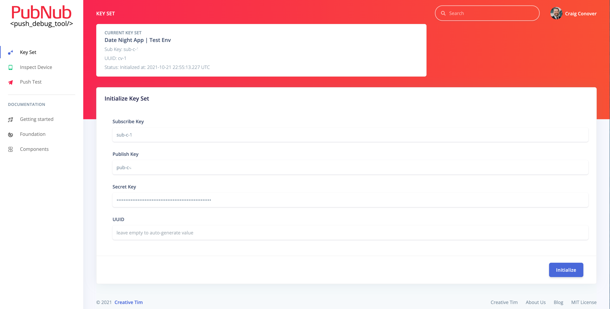
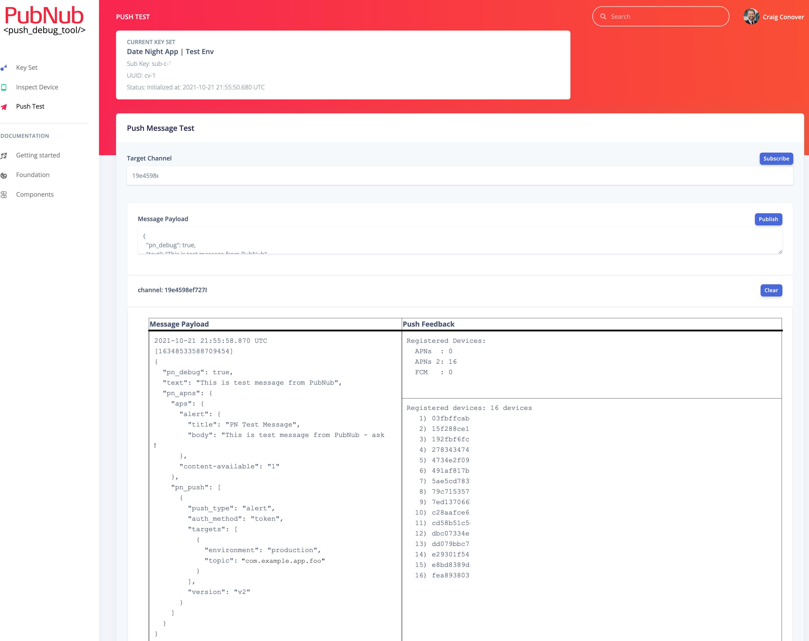
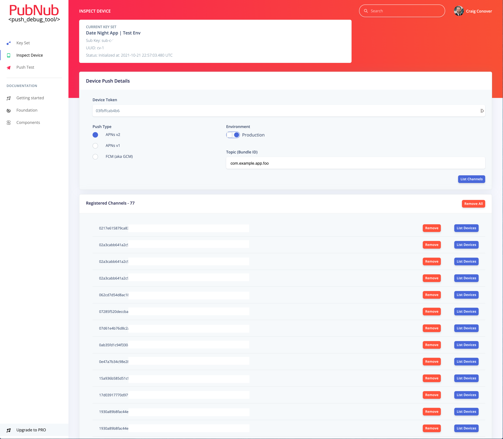

# PubNub Mobile Push Debug Tool
This tool was inspired by many (many...) hours or assisting customers with troubleshooting their mobile push issues (most APNs). The first effort was [documenting the process of troubleshooting mobile push issues](https://www.pubnub.com/docs/resources/mobile-push-troubleshooting) using the PN Debug Console to listen to the the `-pndebug` channel to receive information and error feedback from PubNub pusher system as well as the push vendors (APNs and FCM). 

However, most customers would not bother to go through the trouble of executing on this or were just confused or put off by the complexity of the process. This resulted in many support tickets which resulted in a conf call to do some realtime troubleshooting with the customer.

After years of talking about how great it would be have a tool to automate much of this troubleshooting process, one specific customer had such complex issues that it required daily, multi-hour troubleshooting session using the above process. This motivated me to finally implement this tool and as a bonus, learn React at the same time. The result of this effort is what you see before you. Enjoy!

## Screenshots

### Key Set

Enter your PubNub key set and initialize it for use in the other screens to perform push-related operations: list/add/remove channels for a device token, send a test notification and receive feedback from PubNub and the push vendors (APNs & FCM), list/add/remove device for a channel (coming soon).

### Push Test

Subscribe to a channel (subscribes to `-pndebug`, automatically), enter the proper payload, publish and receive the message and feedback from PubNub and the push vendor systems (APNs and FCM).

### Inspect Device

Enter a device token and required push parameters (push type, environment, bundle id) and list the channels registered to that device and add and remove channels, as needed.

<!-- ### Inspect Channel

(coming soon)
Enter a channel name and list the device tokens registered to that channel and add and remove device tokens, as needed. -->

## Licensing

- Copyright 2021 Creative Tim (https://www.creative-tim.com/?ref=adr-github-readme)

- Licensed under MIT (https://github.com/creativetimofficial/argon-dashboard-react/blob/master/LICENSE.md?ref=creativetim)

## Useful Links

- [Tutorials](https://www.youtube.com/channel/UCVyTG4sCw-rOvB9oHkzZD1w?ref=creativetim)
- [Affiliate Program](https://www.creative-tim.com/affiliates/new?ref=adr-github-readme) (earn money)
- [Blog Creative Tim](http://blog.creative-tim.com/?ref=adr-github-readme)
- [Free Products](https://www.creative-tim.com/bootstrap-themes/free?ref=adr-github-readme) from Creative Tim
- [Premium Products](https://www.creative-tim.com/bootstrap-themes/premium?ref=adr-github-readme) from Creative Tim
- [React Products](https://www.creative-tim.com/bootstrap-themes/react-themes?ref=adr-github-readme) from Creative Tim
- [Angular Products](https://www.creative-tim.com/bootstrap-themes/angular-themes?ref=adr-github-readme) from Creative Tim
- [VueJS Products](https://www.creative-tim.com/bootstrap-themes/vuejs-themes?ref=adr-github-readme) from Creative Tim
- [More products](https://www.creative-tim.com/bootstrap-themes?ref=adr-github-readme) from Creative Tim
- Check our Bundles [here](https://www.creative-tim.com/bundles?ref=adr-github-readme)

### Social Media

Twitter: <https://twitter.com/CreativeTim?ref=creativetim>

Facebook: <https://www.facebook.com/CreativeTim?ref=creativetim>

Dribbble: <https://dribbble.com/creativetim?ref=creativetim>

Instagram: <https://www.instagram.com/CreativeTimOfficial?ref=creativetim>
