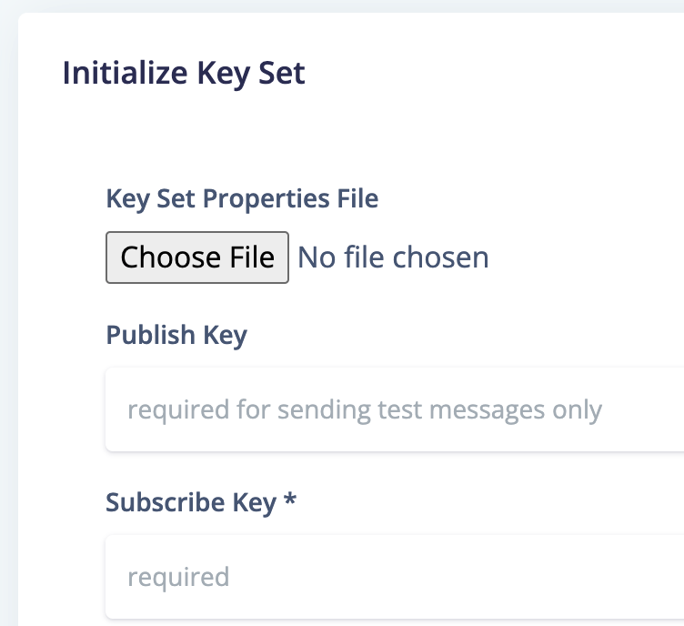
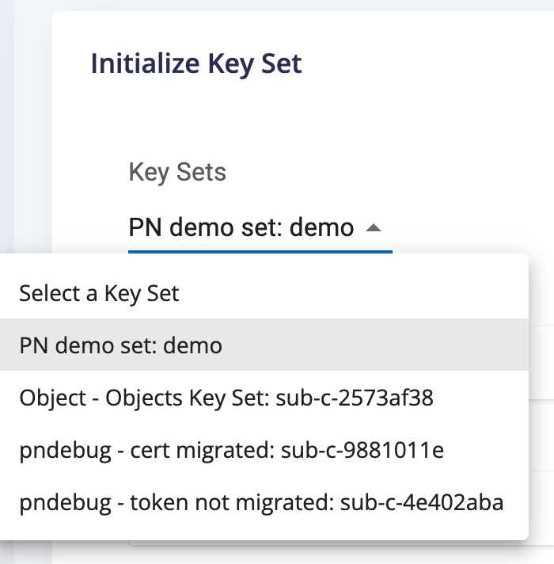

# PubNub Developer Toolbox (aka, "PN Dev Toolbox", "The Toolbox")

This tool was inspired by many (many...) hours of assisting customers with troubleshooting their mobile push issues (most APNs) amongst many other PubNub related issues that required writing code or going through multiple setup steps to analyze, debug, workaround, and resolve. When the answer is "you need to write some code to do that" when it should be a simple tool that does that one thing would be the logical answer, it was not always an optimal customer experience.

After years of talking about how great it would be have tools to automate much of this troubleshooting process, one specific customer had such complex issues that it required daily, multi-hour troubleshooting sessions. This proved to be the tipping point to finally implement this set of Pubnub developer tools, and as a bonus, learn React at the same time. The result of this effort is what you see before you. Enjoy!

## Key Set

Enter your PubNub key set and initialize it for use in the other screens to perform PubNub API operations throughout the various tools in *The Toolbox*. An alternative to entering your key set data manually, you can add them to a key set properties file.

When you upload that file, the UI will load a select field with your key sets from the properties file.

Selecting a key set will auto-populate the fields with the values for that key set.

Click the *Initialize* button to initialize a PubNub object that will be used throughout all the tools to execute PubNub APIs. The *Header* will be updated to indicate that the initialization was successful.

## PN Dashboard Login

(COMING SOON...ISH)
At some point, you will be able to login to your PN account and select a key set. However, having a local properties file that contains common values associated to your key sets will be useful for speedy troubleshooting.

## Tools Menu Options

The rest of the nav links on the left are pluggable tools that can be added as required. The process for creating and adding tools is [documented here](docs/tools/README.md). *The Toolbox* and all tools within are created using the *Argon Dashboard React* template from *Creative Tim*. See below for further details about licensing and usage.

## Licensing

- Copyright 2021 Creative Tim (https://www.creative-tim.com/?ref=adr-github-readme)

- Licensed under MIT (https://github.com/creativetimofficial/argon-dashboard-react/blob/master/LICENSE.md?ref=creativetim)

## Useful Links

- [Tutorials](https://www.youtube.com/channel/UCVyTG4sCw-rOvB9oHkzZD1w?ref=creativetim)
- [Affiliate Program](https://www.creative-tim.com/affiliates/new?ref=adr-github-readme) (earn money)
- [Blog Creative Tim](http://blog.creative-tim.com/?ref=adr-github-readme)
- [Free Products](https://www.creative-tim.com/bootstrap-themes/free?ref=adr-github-readme) from Creative Tim
- [Premium Products](https://www.creative-tim.com/bootstrap-themes/premium?ref=adr-github-readme) from Creative Tim
- [React Products](https://www.creative-tim.com/bootstrap-themes/react-themes?ref=adr-github-readme) from Creative Tim
- [Angular Products](https://www.creative-tim.com/bootstrap-themes/angular-themes?ref=adr-github-readme) from Creative Tim
- [VueJS Products](https://www.creative-tim.com/bootstrap-themes/vuejs-themes?ref=adr-github-readme) from Creative Tim
- [More products](https://www.creative-tim.com/bootstrap-themes?ref=adr-github-readme) from Creative Tim
- Check our Bundles [here](https://www.creative-tim.com/bundles?ref=adr-github-readme)

### Social Media

Twitter: <https://twitter.com/CreativeTim?ref=creativetim>

Facebook: <https://www.facebook.com/CreativeTim?ref=creativetim>

Dribbble: <https://dribbble.com/creativetim?ref=creativetim>

Instagram: <https://www.instagram.com/CreativeTimOfficial?ref=creativetim>
