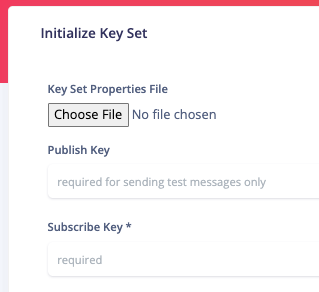
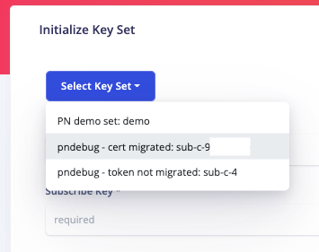
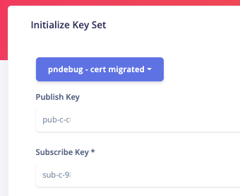
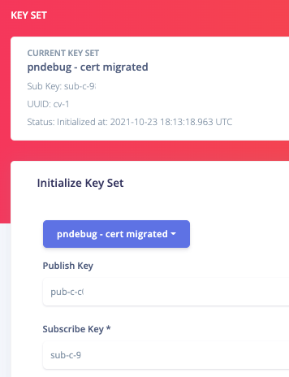

# Key Set Properties File

This tool can use a JSON properties file that you populate with PubNub key sets, channel names, device tokens and other push related properties that you will use multiple times. This will save you from copy/pasting key set values and those other properties over and over again.

Each properties files should only contain key sets that are related to a single entity, like a customer, so that you are not commingling customer data in the same file. Why is this important? Because you may be debugging with a customer and they may see other customer data when you load your properties file.

For example, create a separate properties file for each customer:

* acme.json
* chick-fil-a.json
* in-n-out.json
* private.json (for your own test keys)

If you are working from a cloned git repository, these files will be ignored when you push changes and only the "readme.md" and "properties_template.json" files will be kept.

> :warning: WARNING: DO NOT commit any of your own or other customers' key sets to the repo.

## Properties File Format

* pn_keys - The top level key name that encapsulates all the other properties. Not really necessary unless there are features to add other types of metadata to this file (like username profile information).
  * name - a short name that describes the app (like the name of the key set in your PN account)
  * pub_key, sub_key, secret_key: The PN key set (be careful where you install/run this app if you include the secret key).
  * push_type - the default value for the Push Type/Gateway (apns, apns2, fcm) but you can easily change this in the UI.
  * environment - For APNs/APNs2 only, the default to use but you can easily change this in the UI.
  * topics - AKA, bundle_id, this is for APNs2 only. There may be several of these but typically there is only one. Providing more than one will provide a dropdown of choices in the UI with the first one being the default. You can also entering a different topic, manually.
  * devices - Device tokens are hard to remember so when you are testing a known set of device tokens, it's best to provide them here so you can select them easily in the UI. The first one will be the default. You can provide a list of device tokens for each push type.
  * channels - Often there are a common set of channel names your work with to test push notifications. This list will be provided in the UI with the option to manually enter new channels.

## Screenshots

### Key Set Properties File Chooser

### Key Set Selector Options

### Key Set Selected & Form Populated

### Key Set Initialized & Displayed in Header

