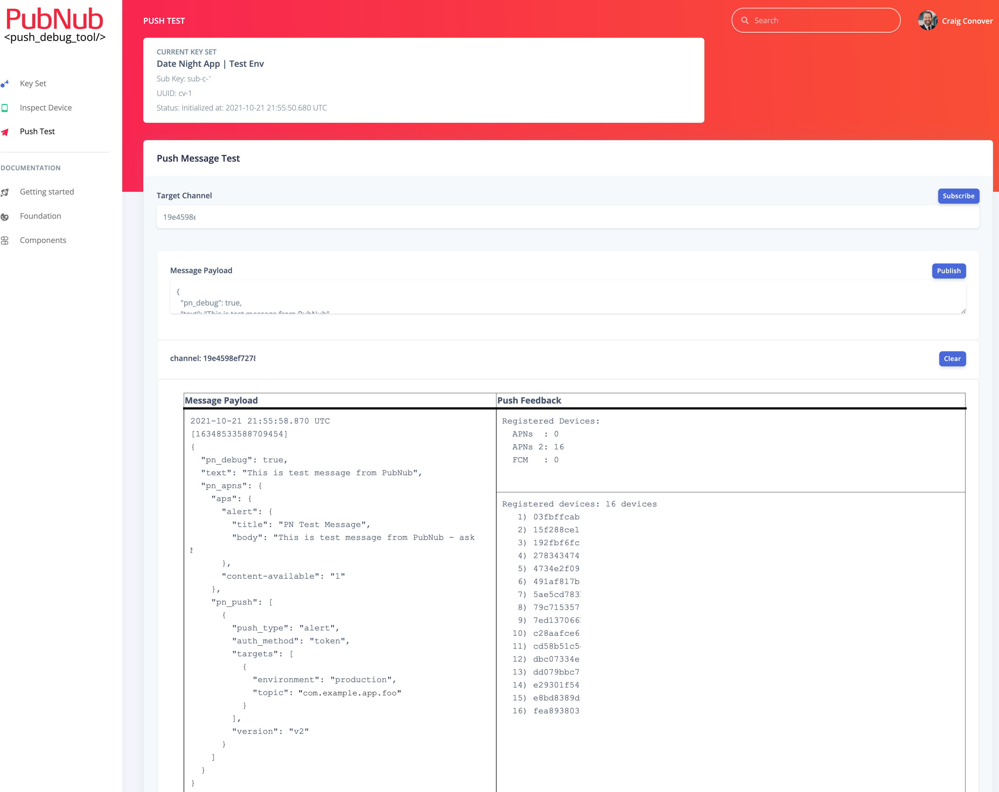
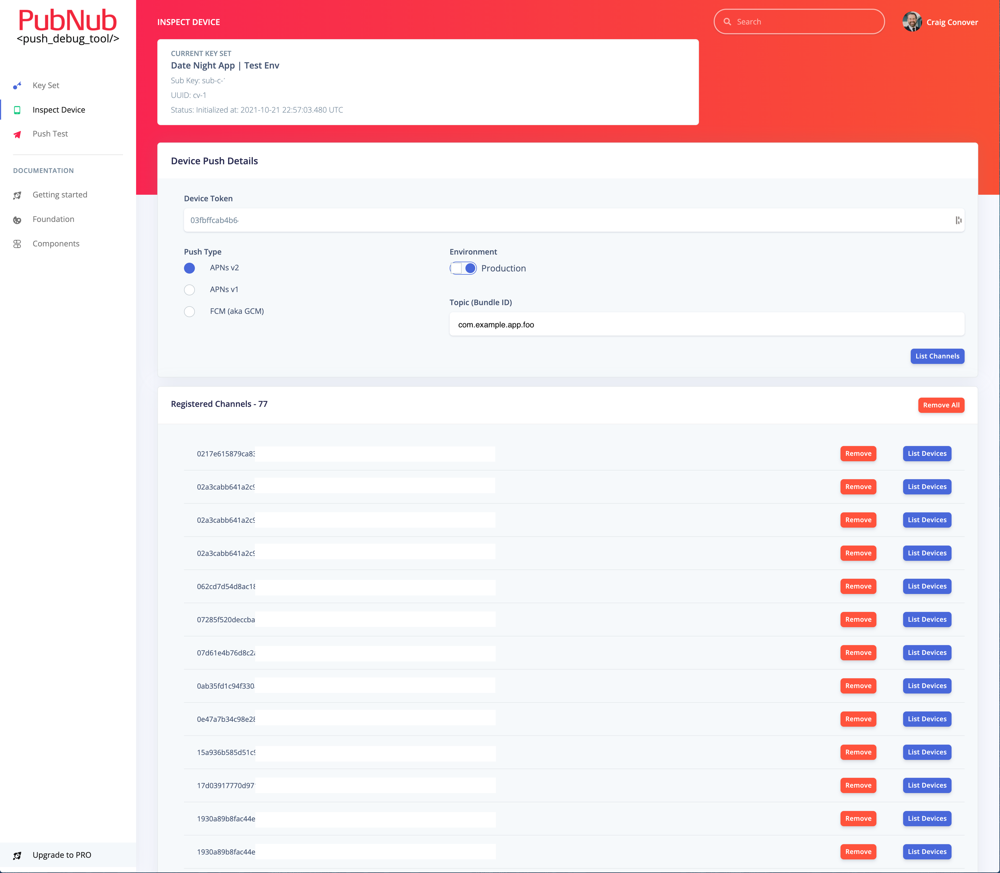

# PubNub Mobile Push Debug Tool

This tool was inspired by many (many...) hours or assisting customers with troubleshooting their mobile push issues (most APNs). The first effort was [documenting the process of troubleshooting mobile push issues](https://www.pubnub.com/docs/resources/mobile-push-troubleshooting) using the PN Debug Console to listen to the the `-pndebug` channel to receive information and error feedback from PubNub pusher system as well as the push vendors (APNs and FCM).

However, most customers would not bother to go through the trouble of executing on this or were just confused or put off by the complexity of the process. This resulted in many support tickets which resulted in a conf call to do some realtime troubleshooting with the customer.

After years of talking about how great it would be have a tool to automate much of this troubleshooting process, one specific customer had such complex issues that it required daily, multi-hour troubleshooting session using the above process. This motivated us to finally implement this tool.

## Push Test

Subscribe to a channel (subscribes to `-pndebug`, automatically), enter the proper payload, publish and receive the message and feedback from PubNub and the push vendor systems (APNs and FCM).

## Manage Device

Enter a device token and required push parameters (push type, environment, bundle id) and list the channels registered to that device and add and remove channels, as needed.

## Manage Channel

Enter a channel name and list the device tokens registered to that channel and add and remove device tokens, as needed. Well, that's the idea, but there aren't any public PN SDK APIs (or REST APIs) that enable this. Until then, we can generate the cURL commands that can be used by PubNub employees with VPN access.
